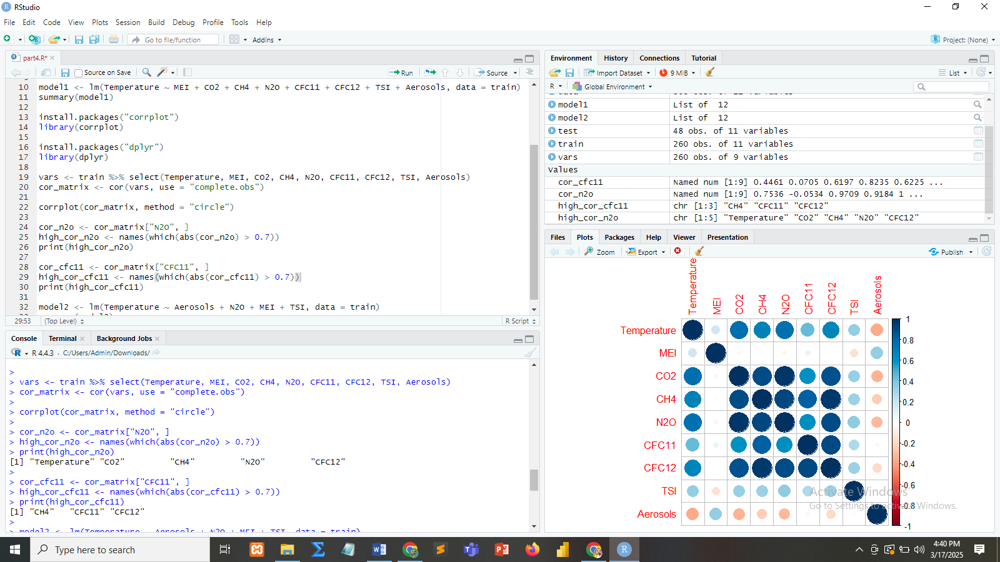

# Climate-Data-Analysis-Using-R
R-based analysis modeling global temperature variations using linear regression. Includes correlation visualization, multicollinearity assessment, and comprehensive documentation of findings.

**Predicting Global Temperature Variations with R**

## Description
This project develops and compares two linear regression models in R to predict average global temperature based on environmental variables (MEI, CO2, CH4, N2O, CFC11, CFC12, TSI, Aerosols). It includes:

- Data splitting into training (≤2004) and testing (>2004) sets  
- Full and reduced model development  
- Correlation matrix visualization using `corrplot`  
- Multicollinearity assessment  
- Detailed documentation of code, results, and interpretations  


## Prerequisites
- **R** (≥4.0)  
- **RStudio** (recommended)  
- R packages: `readxl`, `dplyr`, `corrplot`

## Getting Started

1. **Clone the repository**  
   ```bash
   git clone https://github.com/yourusername/climate-data-analysis.git
   cd climate-data-analysis

1. **Install required packages**

   ```bash
    install.packages(c("readxl", "dplyr", "corrplot"))
   
Run the analysis

Open analysis.R in RStudio and execute all chunks.

## Key Results
- **Full model R²:** 0.7272; significant predictors: MEI, CO2, N2O, CFC11, CFC12, TSI, Aerosols

- **Reduced model R²:** 0.6975; all included variables remain significant

- **N2O coefficient shift:** from –0.02324 (full) to +0.02527 (reduced), indicating multicollinearity effects

### Correlation Matrix
Here is the correlation plot showing relationships among variables:


